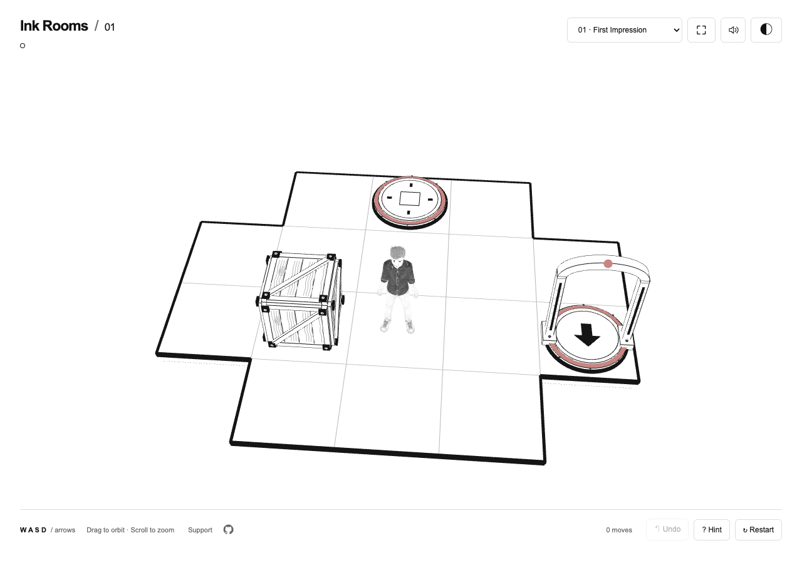

# Ink Rooms

A monochrome 3D puzzle game by Adam Holter, built with help from OpenAI Astra, using Three.js. Push crates onto marks across 44 floating rooms. Later rooms add height, switches, elevators, bridges, robots, ice, and rotating sections.

[Play the game](https://adam-ink-playground.vercel.app/) · [Support Adam](https://buymeacoffee.com/adamholter)

The code is MIT-licensed. Adam's character and the bundled media are included under a separate [reserved asset license](ASSET-RIGHTS.md), so you can run the game locally without granting general reuse of his likeness.



The screenshot and character shown above are covered by the reserved asset license.

## Run locally

Use Node.js 22.13 or newer.

```sh
npm ci
npm run dev
```

Open the local URL printed by Vite. Everything runs in your browser. No account, API key, or backend is needed.

```sh
npm run validate   # puzzle tests, typecheck, production build
npm run build      # static files in dist-game/
npm run preview    # serve the production build locally
```

## Controls

- WASD or arrow keys to move and push. Touch devices have directional buttons.
- Z to undo, R to restart, H for a hint, V for the full-platform view.
- Drag to orbit and scroll to zoom.
- Walk into raised ledges to climb automatically. There is no jump button.
- The speaker and theme buttons toggle sound and the white or black background.

Progress and preferences stay in local storage. Music begins after your first interaction.

## Mechanics

Crates move across the same floor height or down to a lower floor. Drops between floors are permanent until you undo. Falling off the platform restores the previous safe move.

Pressure plates operate numbered elevators and bridges. Each successful player move tells the robot to move in the same direction. If the robot is blocked, it stays put while you move.

On ice, the player or a pushed crate slides straight until reaching dry floor or an obstacle. Sliding over an open edge causes a fall. Robots brake at edges.

A newly activated turntable switch rotates its section clockwise by 90 degrees, carrying its floor, walls, targets, and occupants. Release and reactivate the switch for another turn. Undo works during the animation.

## Source map

- `src/puzzle.ts`: movement, machinery, state, and hint solving.
- `src/game.ts`: rendering, input, camera, and animation.
- `src/*-levels.ts`: room layouts.
- `src/art.ts`, `src/machinery-art.ts`, `src/robot-art.ts`, `src/rotation-art.ts`: procedural models.
- `src/hint-worker.ts`: background hint worker.
- `public/character.glb`: rigged character with Idle and Run animations.
- `public/audio/`: music and sound effects.
- `scripts/test-*.ts` and `scripts/fixtures/`: rules, solution paths, and difficulty checks.

The current layouts replaced early designs that reused public Sokoban puzzles. A finite audit of all 44 current rooms found no exact matches against 10,902 public entries. Rooms 37 through 44 also passed the [near-match checks](scripts/audit-data/rotation-expansion-audit.md). This does not prove worldwide uniqueness. Public puzzle collections are not bundled here. `npm run audit:originality` downloads the attributed collections listed in `scripts/audit-data/sources.json` and runs the comparison.

The [rotation difficulty report](scripts/audit-data/rotation-difficulty.md) records the room 39 revision and room 44 addition, with minimum-push and temporary-parking proofs.

## Credits and license

Source code is MIT-licensed under [LICENSE-CODE](LICENSE-CODE). The character, likeness, and bundled media are excluded. See [license scope](LICENSE), [asset rights](ASSET-RIGHTS.md), and [credits](CREDITS.md).

You may clone the repository and play or test the game locally under the asset terms. To publish your own game or reuse the character elsewhere, replace the reserved assets or obtain Adam's separate written permission. These asset restrictions do not restrict reuse of the MIT-licensed code.

The public source release is [adamholter/ink-rooms-source](https://github.com/adamholter/ink-rooms-source). Its history begins with these separate license terms.
